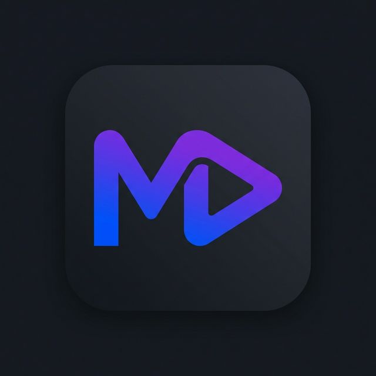

# 🎬 MovieHub - Hybrid Cinema Experience

MovieHub is a premium, high-performance Flutter application that bridges the gap between massive FTP movie libraries and rich TMDB metadata. It offers a seamless, Netflix-style experience with instant streaming and advanced background downloading.



## 🚀 Key Features

### 💎 Premium Hybrid System
- **FTP + TMDB Integration**: Enjoy the speed of FTP servers with the rich metadata (posters, ratings, trailers) of TMDB.
- **Guaranteed Playback**: The home screen only features movies with verified playable FTP links.
- **Smart Enrichment**: Backend automatically matches FTP directory names with TMDB entries for a professional look.

### 🎥 Superior Playback
- **Universal Player**: Powered by BetterPlayer, supporting direct FTP streaming, MP4, MKV, and more.
- **Header Injection**: Custom User-Agent and Referer injection to bypass hotlink protections on various hosts.
- **PiP Support**: Picture-in-Picture mode for multitasking.

### 📥 Pro-Grade Downloads
- **Real-Time Sync**: Live progress updates on the download screen with accurate speed and sizing.
- **Background Support**: Stable downloads that continue even when the app is closed.
- **Intelligent Queue**: Manage multiple downloads with pause/resume functionality.

### 🔍 Discovery & Search
- **Multi-Source Search**: Scrapes FTP, SkyMoviesHD, HDHub4u, and more in parallel.
- **Advanced Filtering**: Filter by quality, year, and genre.
- **AI-Powered "For You"**: Personalized recommendations based on your watch history.

---

## 🛠 Tech Stack

### Frontend (Flutter)
- **State Management**: [GetX](https://pub.dev/packages/get)
- **Local Storage**: [Hive](https://pub.dev/packages/hive) (for blazing fast caching)
- **Video Engine**: [BetterPlayer Enhanced](https://pub.dev/packages/better_player_enhanced)
- **UI Components**: Google Fonts (Inter, Plus Jakarta Sans), Lottie animations.
- **Backend Sync**: [Firebase](https://firebase.google.com/) (Auth, Remote Config, Cloud Messaging).

### Backend (FastAPI)
- **Framework**: [FastAPI](https://fastapi.tiangolo.com/) (Asynchronous Python)
- **Scraping Engine**: [Playwright](https://playwright.dev/) with Stealth mode.
- **Processing**: BeautifulSoup4 & aiohttp for high-speed concurrent requests.
- **Database**: SQLite (Administrative data & local scraping cache).

---

## ⚙️ Setup & Installation

### Backend Setup
1. Navigate to the `backend/` directory.
2. Create a virtual environment:
   ```bash
   python -m venv venv
   source venv/bin/activate  # On Windows: .\venv\Scripts\Activate.ps1
   ```
3. Install dependencies:
   ```bash
   pip install -r requirements.txt
   playwright install chromium
   ```
4. Start the server:
   ```bash
   python -m uvicorn main:app --port 8000 --reload
   ```

### Frontend Setup
1. Ensure you have [Flutter SDK](https://docs.flutter.dev/get-started/install) installed.
2. Fetch dependencies:
   ```bash
   flutter pub get
   ```
3. Run the application:
   ```bash
   flutter run --release # For best performance
   ```

---

## 📁 Project Structure

```text
├── lib/                  # Flutter application source
│   ├── controllers/      # GetX State management
│   ├── models/           # Data structures (Movie, DownloadTask, etc.)
│   ├── screens/          # UI Layers & Screen Navigation
│   ├── services/         # API & Backend interactions
│   └── widgets/          # Reusable UI components
├── backend/              # Python FastAPI source
│   ├── scrapers/         # Source-specific scraping logic
│   ├── main.py           # API endpoints & Core Logic
│   └── requirements.txt  # Python dependencies
├── assets/               # Images, Lottie, and Fonts
└── testsprite_tests/     # Automated QA Test Reports
```

---

## 🛡 Disclaimer
This application is for educational purposes only. MovieHub does not host any media; it acts as a browser-like interface to publicly available indices.

---
*Developed with ❤️ by the MovieHub Team.*
